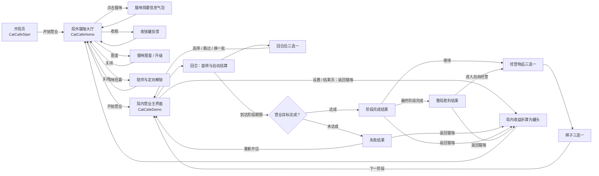
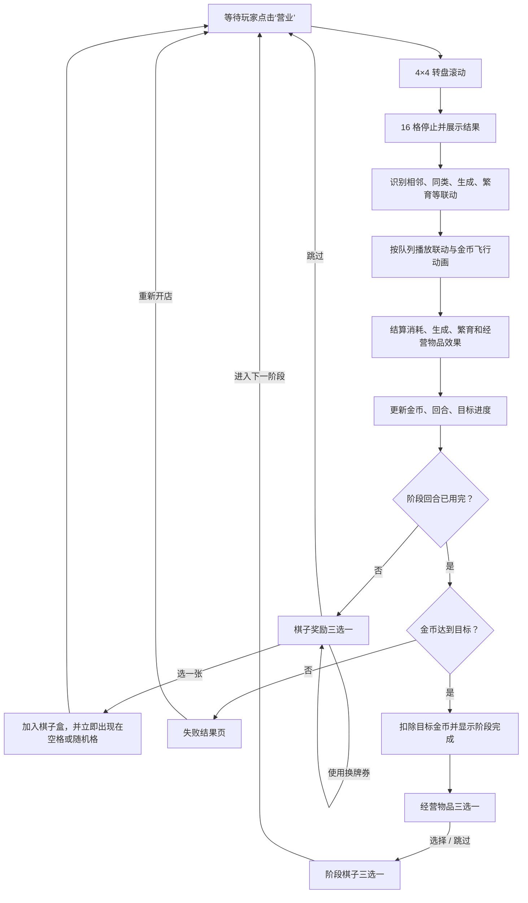
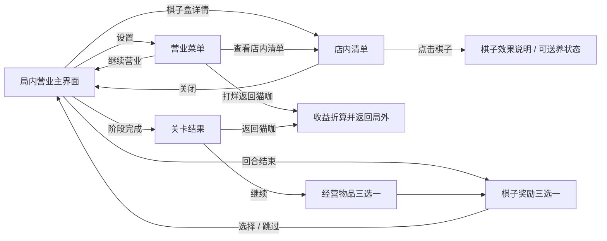
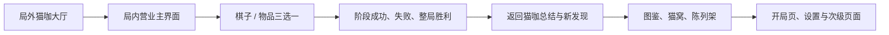

# 猫咖幸运房东｜页面跳转与 UI 需求

> 基于当前 Unity `main` 分支整理。实际 Build 场景顺序为：`CatCafeStart` → `CatCafeHome` → `CatCafeDemo`。

## 1. 页面大循环

## 2. 局内回合循环

## 3. 局内覆盖层关系

## 4. 当前需要 UI 的页面与模块

状态说明：

- **已有**：当前 Unity 已经存在对应逻辑和运行时 UI。
- **需正式美术**：功能已能运行，但仍是程序生成、占位或未完成拆分的界面。
- **尚缺**：当前代码中没有完整页面，需要补交互和 UI。

| 页面 / 模块 | 当前状态 | 必要 UI 内容 | 优先级 |
|---|---|---|---|
| 开局页 | 已有，需正式美术 | Logo、主视觉、开始按钮、存档状态、设置入口 | P1 |
| 局外猫咖大厅 | 已有，需正式美术 | 猫咪可移动场景、家具互动点、顶部资源、今日委托、收钱罐、功能入口 | P0 |
| 今日委托详情 | 尚缺独立详情 | 委托目标、进度、奖励、完成状态 | P1 |
| 猫咪图鉴 | 已有，需正式美术 | 品种卡、未解锁剪影、数量、等级、升级按钮、详情态 | P0 |
| 猫咪详情 / 升级确认 | 当前并在图鉴卡中 | 立绘、来源、等级效果、升级材料、升级前后对比 | P1 |
| 猫咪招募 | 已有，需正式美术 | 邀请猫、目标猫剪影、绒毛与罐头需求、招募按钮、成功反馈 | P0 |
| 陈列架 / 营业符号收藏 | 尚缺 | 局内带回的客人、设施、员工与物件；分类、发现状态、来源 | P1 |
| 局内营业主界面 | 已有，正式 UI 正在导入 | 4×4 转盘、营业目标、金币、回合、Buff 区、棋子盒预览、营业按钮、设置 | P0 |
| Buff 区 | 已有逻辑，需正式美术 | Buff 图标、名称、效果、页码、前后翻页、悬停说明 | P0 |
| 棋子盒预览 | 已有逻辑，需拆图和正式美术 | 当前页 8 枚棋子、前后翻页、点击查看效果 | P0 |
| 棋子效果提示 | 已有简易提示，需统一样式 | 名称、标签、基础收益、联动规则、稀有度 | P0 |
| 棋子奖励三选一 | 已有，需正式美术 | 3 张奖励卡、选择状态、跳过、换一批及剩余券数 | P0 |
| 经营物品三选一 | 已有，需正式美术 | 3 张物品卡、持续效果、稀有度、跳过 | P0 |
| 店内清单 | 已有，需正式美术 | 完整棋子池、数量、效果、送养按钮、送养券数量、分页 | P1 |
| 设置 / 营业菜单 | 已有，需正式美术 | 继续、店内清单、打烊返回、音量与基础设置 | P1 |
| 阶段成功结果 | 已有，需正式美术 | 达标金额、扣除金额、剩余金币、券奖励、继续按钮 | P0 |
| 阶段失败结果 | 已有，需正式美术 | 目标差额、失败原因提示、局外收益、重新开店、返回猫咖 | P0 |
| 整局胜利结果 | 已有，需正式美术 | 三阶段完成、局外奖励、首次发现、自由经营或返回猫咖 | P0 |
| 返回猫咖总结 | 尚缺 | 本局时长、通过阶段、罐头、发现猫咪、发现物件、图鉴进度变化 | P0 |
| 新猫 / 新物件发现弹窗 | 尚缺 | 新发现立绘、名称、稀有度、加入图鉴 / 陈列架的去向 | P0 |
| 新手引导层 | 尚缺 | 第一次营业、旋转、三选一、联动、目标、打烊与局外回流 | P0 |
| 通用反馈层 | 部分已有 | Toast、金币飞行、联动连线、点击反馈、锁定态、禁用态、加载转场 | P0 |

## 5. 建议的正式 UI 生产顺序

优先先打通一条可完整体验的视觉闭环：

**猫咖大厅 → 开始营业 → 旋转结算 → 三选一 → 阶段结果 → 返回猫咖总结 → 新内容出现在大厅。**

这条闭环完成后，玩家才能直观看懂“局内获得内容，局外猫咖因此变丰富”的产品核心。

## 6. 当前流程中最明显的 UI 缺口

1. **返回猫咖时没有完整结算页。** 当前收益会直接折算并加载局外场景，玩家不容易理解局内成果去了哪里。
2. **陈列架尚未成为 Unity 中的正式页面。** 局内非猫符号缺少明确的局外归宿。
3. **新发现缺少强反馈。** 新猫、新物件需要单独亮相，再明确飞入图鉴、陈列架或猫咖场景。
4. **局外大厅需要承担导航。** 尽量让图鉴、猫窝、陈列架、委托和收钱罐成为场景中的纸艺机关，而不是额外铺一排普通按钮。
5. **缺少第一局引导层。** 玩家需要在第一次完整循环中理解：营业、结算、选牌、达标、打烊、回流。
